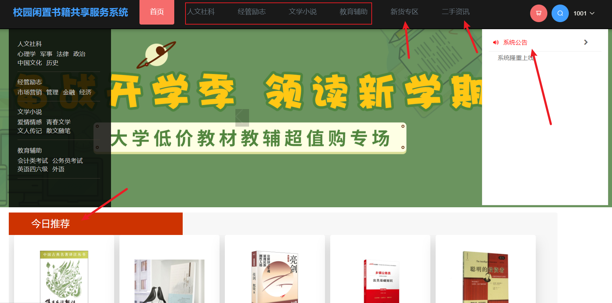
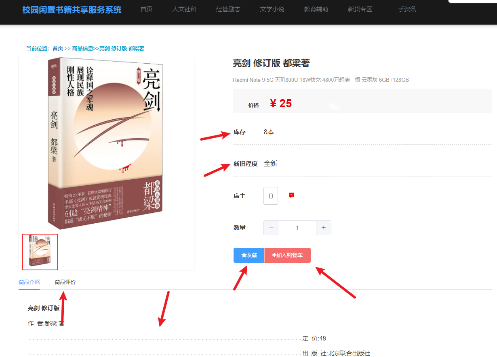
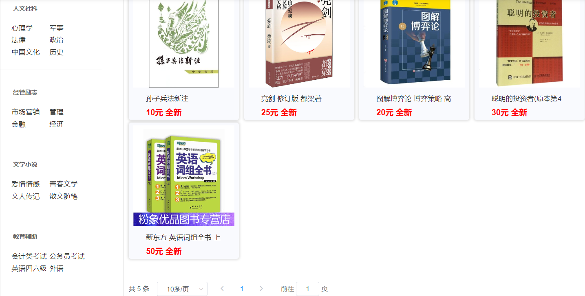
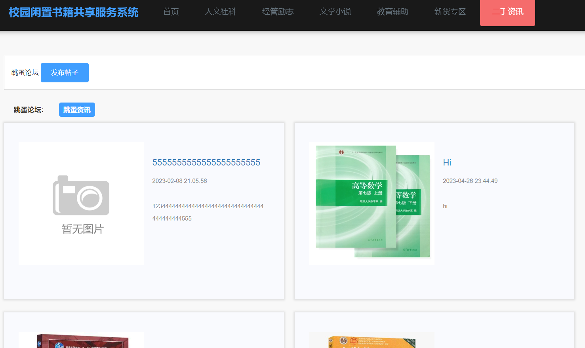
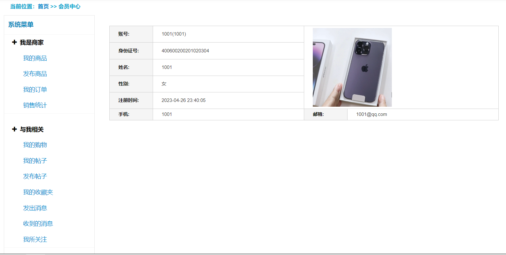
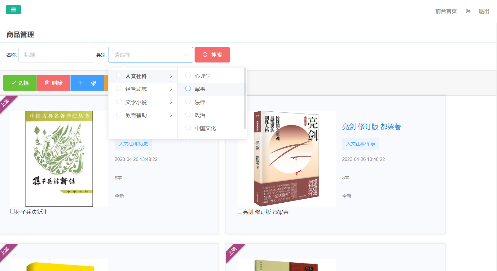
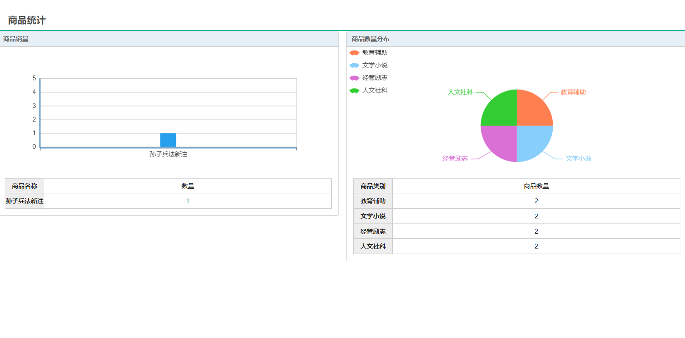
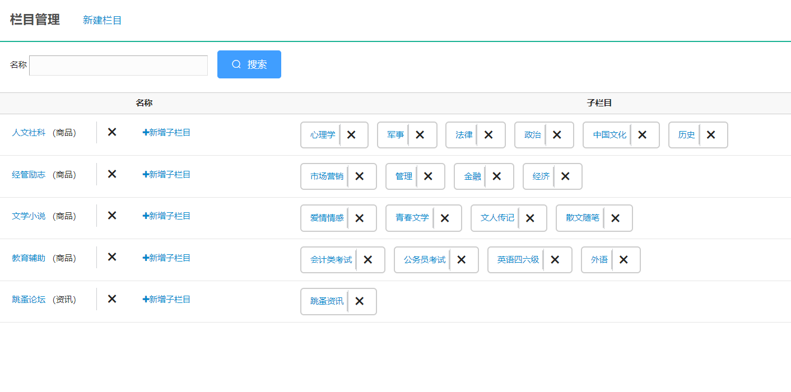

> 【**项目特色**】
>
> - **自定义**导航栏
> - **可视化**统计
> - 二手资讯栏目，可以发**帖子**，发**求购**信息
> - **QQ:3270728362**

## 简介

**基于SpringBoot的校园二手书籍交易平台**

- 开发语言：Java
- 数据库：MySQL
- 技术：SpringBoot+MyBatis
- 工具：IDEA/Ecilpse、Navicat、Maven

---

## 系统展示

>导航栏全部可以自定义，改成自己需要的栏目

>商品详情界面，可以看到库存，新旧程度，商品介绍和评价。

>商品分类，可以二级子分类。

>二手资讯栏目，可以在此发帖子，求购信息。

>用户既可以是商家，也可以是买家。
>
>- 作为卖家可以看到自己发布的商品、订单、销售统计等。
>- 作为买家可以看到自己的帖子、收藏夹等。

>管理员，商品管理界面

>可视化展示

>分类

